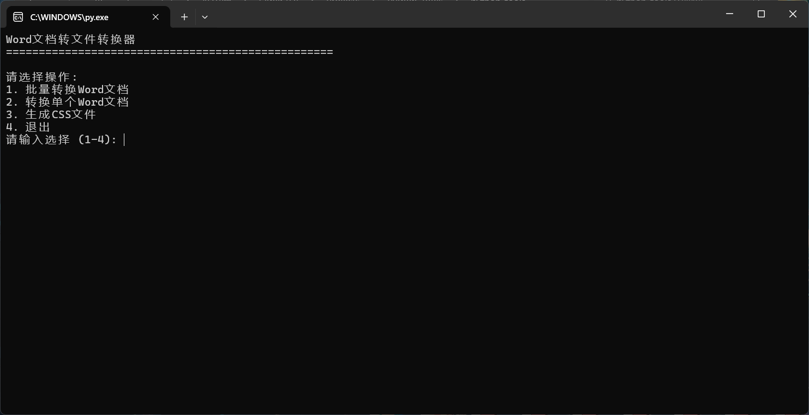
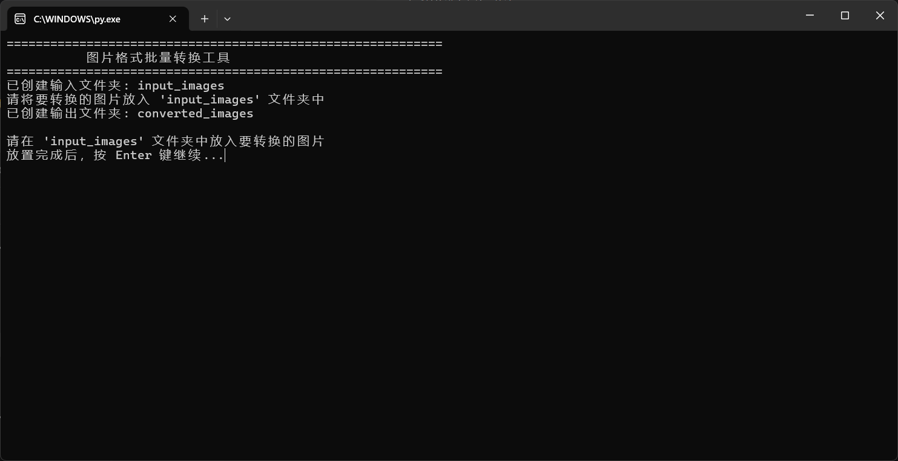

# Python Tools  
一系列通过Python实现的小工具集合  

首先请确保支持python运行环境，并安装所需依赖库。 

## 📋 工具列表  

### Word_To_Html_Or_Js - Word文档转HTML/JS、CSS文件  
**文件**: `Word_To_Html_Or_Js.py`  

#### 功能描述  
将Word文档(.docx格式)转换为HTML(.html)/JavaScript(.js)和CSS(.css)文件，便于在网页中使用Word文档内容。  

#### 功能/注意事项  
-  提取文本内容到HTML/JS文件  
-  提取样式信息到CSS文件  
-  保持基本的格式结构  

-  仅支持 .docx 格式  
-  生成后请手动检查和调整样式以确保符合需求

#### 使用方法  

-  安装额外依赖库:    
```bash
pip install python-docx
```

- 使用  
直接运行脚本，按照提示操作。  

- 相关示例  
  

### Picture_Batch_Conv - 图片批量格式转换工具  
**文件**: `Picture_Batch_Conv.py`  

#### 功能描述  
支持多种图片格式之间的批量转换，包括PNG、WEBP、JPG、JPEG、JPE、TIF、TIFF、BMP等格式。 

#### 功能/注意事项  
- 支持多种图片格式的相互转换  
- 自动创建输入（input_images）和输出（converted_images）文件夹  
- 批量处理文件夹中的所有图片文件  
- 显示详细的转换进度和统计信息  
- 智能处理透明通道（转换为JPG等格式时自动填充白色背景）  
- 输入文件夹中不支持的文件会被跳过并提示  

#### 使用方法  

-  安装额外依赖库:    
```bash
pip install Pillow
```

- 使用  
直接运行脚本，按照提示操作。  

- 相关示例  
  