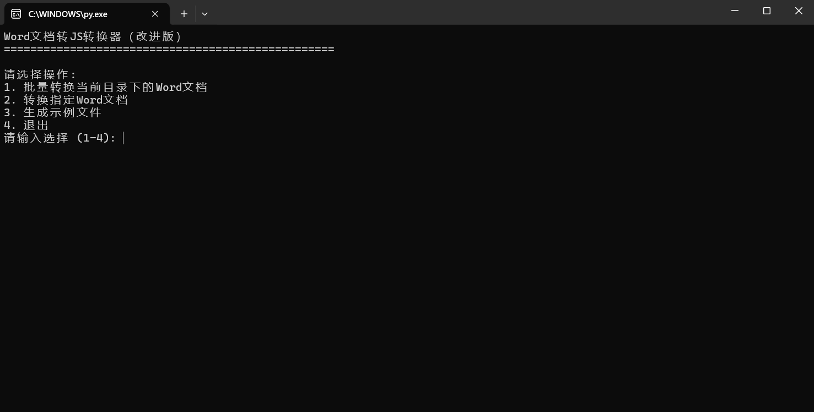

# Python Tools  
一系列通过Python实现的小工具集合  

## 📋 工具列表  

### WordToJs - Word文档转JS/CSS文件  
**文件**: `WordToJs.py`  

#### 功能描述  
将Word文档(.docx格式)转换为JavaScript(.js)和CSS(.css)文件，便于在网页中使用Word文档内容。  

#### 功能/注意事项  
-  仅支持 .docx 格式  
-  提取文本内容到JS文件  
-  提取样式信息到CSS文件  
-  保持基本的格式结构  

#### 使用方法  

首先请确保支持python运行环境，并安装所需依赖库。  

-  安装额外依赖库:    
```bash
pip install python-docx
```

- 使用  
直接运行脚本，按照提示操作。  

- 示例  
  