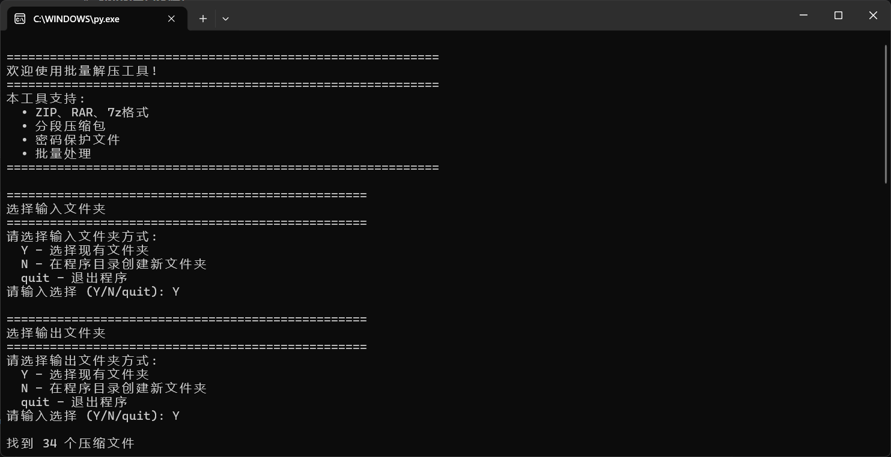

# Python Tools  
一系列通过Python实现的小工具集合  

首先请确保支持python运行环境，并安装所需依赖库。 

## 📋 工具列表  

### Word_To_Html_Or_Js - Word文档转HTML/JS、CSS文件  
**文件**: `Word_To_Html_Or_Js.py`  

#### 功能描述  
将Word文档(.docx格式)转换为HTML(.html)/JavaScript(.js)和CSS(.css)文件，便于在网页中使用Word文档内容。  

#### 注意事项  
-  仅支持 .docx 格式  
-  生成后请手动检查和调整样式以确保符合需求

#### 安装额外依赖库  

-  安装额外依赖库:    
```bash
pip install python-docx
```

- 相关示例  
  

### Picture_Batch_Conv - 图片批量格式转换工具  
**文件**: `Picture_Batch_Conv.py`  

#### 功能描述  
支持多种图片格式之间的批量转换，包括PNG、WEBP、JPG、JPEG、JPE、TIF、TIFF、BMP等格式。 

#### 注意事项  
- 转换为JPG等格式时自动填充白色背景  
- 输入文件夹中不支持的文件会被跳过并提示  

#### 安装额外依赖库  
    
```bash
pip install Pillow
```  

- 相关示例  
  

### Batch_Decompress - 批量解压工具  
**文件**: `Batch_Decompress.py`  

#### 功能描述  
批量解压多种格式的压缩文件，支持ZIP、RAR、7z等常见格式，能够自动识别分段压缩包并合并解压。  

#### 注意事项  
##### 系统要求  

- Windows: 需要安装WinRAR或unrar工具  

- macOS: brew install unrar  

- Linux: sudo apt-get install unrar (Ubuntu/Debian)  

#### 安装额外依赖库  
    
```bash
pip install rarfile py7zr
```  

- 相关示例  
  
